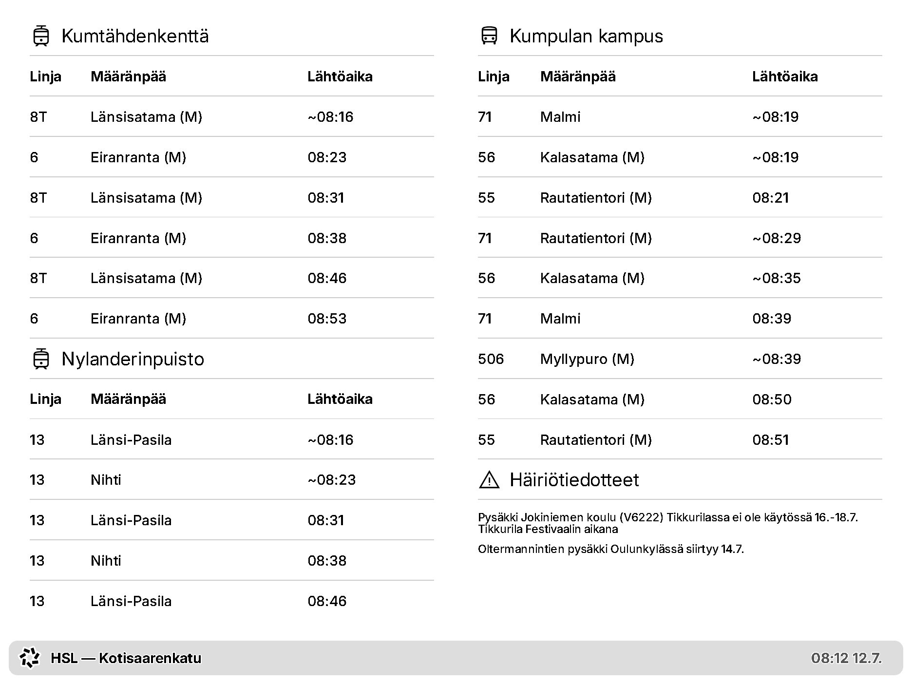

# TRMNL HSL departure board plugin



A live public transport departure board for a [TRMNL](https://usetrmnl.com)
e-ink display, showing the next departures from your chosen [HSL](https://www.hsl.fi/en)
(Helsinki Regional Transport Authority) stops.

A small always-on HTTP server fetches departures from the
[Digitransit](https://digitransit.fi/en/) GraphQL API, reshapes them and serves
ready-to-render markup.

The server is written in Clojure on [Babashka](https://babashka.org) with a single `bb` binary,
no build step and no external dependencies to resolve.

## How it works

```
                        ┌────────────────────────────────────────────┐
 Digitransit GraphQL ──▶│ bb server (http-kit) :4001                 │
   (api.digitransit.fi) │   in-process TTL cache (atom)              │
                        │   GET /api/trmnl/<board> → {markup, …}     │
                        │   GET /preview/<board>   → full HTML (dev) │
                        │   GET /health            → status JSON     │
                        └────────────────────▲───────────────────────┘
                                             │ polls every N min
        reverse proxy (TLS + IP allowlist) ──┤
                                             │
                                        TRMNL cloud → e-ink device
```

TRMNL's Polling strategy has the TRMNL cloud fetch a URL on a schedule. This
server renders the board itself and returns it as the four layout fields
TRMNL expects: `markup`, `markup_half_horizontal`, `markup_half_vertical` and
`markup_quadrant`. All the logic lives in this repo, not in the TRMNL editor.

The server hosts multiple boards, each identified by a URL slug and served at
`/api/trmnl/<slug>`. Configure one Private Plugin per board.

## Prerequisites

- A TRMNL device with the ability to add a
  [Private Plugin](https://help.trmnl.com/en/articles/9510536-private-plugins).
  The implementation has been tested on a TRMNL X (1872×1404).
- The [Babashka](https://github.com/babashka/babashka#installation) (`bb`) runtime.
- A Digitransit API subscription key. Register at the
  [Digitransit API portal](https://portal-api.digitransit.fi/), create a
  subscription and copy the key to `.env` (see below).
- Somewhere to run the server reachable by the TRMNL cloud. A reverse proxy for
  TLS and access control is strongly recommended (see below).

## Quick start (local)

```sh
git clone https://github.com/pvalkone/trmnl-hsl.git
cd trmnl-hsl
cp .env.example .env
$EDITOR .env # Paste in your DIGITRANSIT_KEY
bb serve     # Starts the server on http://localhost:4001
```

Then:

```sh
curl -s localhost:4001/health                               # Lists all configured boards
curl -s localhost:4001/api/trmnl/kotisaarenkatu | jq 'keys' # Returns the four markup keys
open http://localhost:4001/preview/kotisaarenkatu           # Eyeball the full board in a browser
```

`kotisaarenkatu` is the board slug (a key in `boards`, see below).

The data transform ([`board.clj`](src/hsl/board.clj)) and the alert/pluralisation
logic ([`render.clj`](src/hsl/render.clj)) are covered by unit tests in `test/hsl/`.

Run the tests with `bb test`.

## Configuration

### Environment variables

Variables are read from the real environment first, then an `.env` file (see
`.env.example`):

| Variable          | Required | Default | Description                                          |
|-------------------|----------|---------|------------------------------------------------------|
| `DIGITRANSIT_KEY` | yes      | -       | Your Digitransit subscription key                    |
| `PORT`            | no       | `4001`  | The HTTP port to listen on                           |
| `CACHE_TTL_MS`    | no       | `60000` | How long a fetched board is reused before refetching |

### Boards: which stops, which routes

Everything about what the boards show lives in
[`src/hsl/config.clj`](src/hsl/config.clj). `boards` maps a URL slug to a board
definition; each slug is served at `/api/trmnl/<slug>` and `/preview/<slug>`
.
Add a board by adding a key; there is no per-board setup beyond this map.

Each board has a two-column layout; each column lists a set of stops and splits
its row budget evenly across them:

```clojure
{"my-board"                 ; URL slug: served at /api/trmnl/my-board
 {:title "My board title"   ; Shown in the bottom status bar
  :number-of-departures 20  ; How many upcoming departures to fetch per stop
  :columns
  {:left {:rows 12 ; Total departure rows for this column
          :stop-ids ["HSL:1230410" "HSL:1210405"]
          :hidden-routes {}}
   :right {:rows 9
           :stop-ids ["HSL:1240118" "HSL:1230109"]
           ;; Denylist: drop these route patterns at a given stop
           :hidden-routes {"HSL:1240118" ["HSL:4717:717:Rautatientori:1"]}
           ;; Allowlist: at these stops, show only the listed patterns
           :show-routes {"HSL:1230109" ["HSL:1071:71:Malmi:0"]}
           ;; Optional: override the heading for a stop (e.g. to tell apart
           ;; several stops that share a Digitransit name)
           :stop-names {"HSL:1230109" "Kumpulan kampus (M)"}}}}}
```

- `stop-ids` are Digitransit GTFS stop IDs (e.g. `HSL:1230410`).
- `:hidden-routes`/`:show-routes` are keyed by stop ID and take a list of
  route keys of the form `"<routeGtfsId>:<shortName>:<headsign>:<directionId>"`.
  Use `:hidden-routes` to drop noise (e.g. a line that also stops elsewhere on
  your board) and `:show-routes` to pin a stop to only the lines you care about.
- `:stop-names` (optional) is keyed by stop ID and overrides the heading a stop
  renders under. Departures group by heading, so stops that share a Digitransit
  name (e.g. three "Tekniikan museo" stops on different streets) need distinct
  overrides to list separately.

Finding stop IDs and route keys: the easiest way is to hit `/preview` (or
`/api/trmnl`) with the stop in `:stop-ids` and no filters. Every departure's line,
destination and direction are visible, so you can read off the exact route key to
filter.

To find a stop ID, search the stop on the
[HSL Journey Planner](https://reittiopas.hsl.fi/) or query it by name via the
[Digitransit Routing API](https://digitransit.fi/en/developers/apis/1-routing-api/stops/).

### Templates

The HTML lives in [`views/full.html`](views/full.html) (the main board) and
[`views/compact.html`](views/compact.html) (a single-column stand-in used for the
smaller half/quadrant layouts). They're [Selmer](https://github.com/yogthos/Selmer)
templates and use TRMNL's [design framework](https://trmnl.com/framework) classes
(`.layout`, `.columns`, `.table`, `.title`, `.label` and `.title_bar`).

## TRMNL plugin setup

1. In the [TRMNL dashboard](https://trmnl.com/dashboard), add a Private Plugin with the Polling strategy.
   Add one plugin per board.
2. Set the Polling URL to your server's `/api/trmnl/<slug>` endpoint (through your
   reverse proxy; e.g. `https://board.example.com/api/trmnl/kotisaarenkatu`).
3. Set each layout's markup to the matching response field.

   | Layout | Markup |
   |---|---|
   | Full | `{{ markup }}` |
   | Half Horizontal | `{{ markup_half_horizontal }}` |
   | Half Vertical | `{{ markup_half_vertical }}` |
   | Quadrant | `{{ markup_quadrant }}` |

4. Force a refresh and check the device.

## Deployment

The server is a plain HTTP process; run it under any supervisor and put a reverse
proxy in front for TLS and access control.

### Access control

The polling URL is fetched by the TRMNL cloud, so it must be reachable from the
Internet. Rather than expose the server openly, restrict it to TRMNL's published
egress IPs, available at <https://trmnl.com/api/ips>.

### Run as a service

An example FreeBSD (`rc.d`) service script is in
[`deploy/freebsd/trmnl_hsl`](deploy/freebsd/trmnl_hsl). To install it:

```sh
install -m 755 deploy/freebsd/trmnl_hsl /usr/local/etc/rc.d/trmnl_hsl
sysrc trmnl_hsl_enable=YES
service trmnl_hsl start
```

## Acknowledgements

Architecture inspired by
[`heikkiv/trmnl-nordpool`](https://github.com/heikkiv/trmnl-nordpool).

Departure data © [Digitransit](https://digitransit.fi/en/), licenced
[CC BY 4.0](https://creativecommons.org/licences/by/4.0/).

## Licence

MIT. See [LICENCE](LICENCE).
